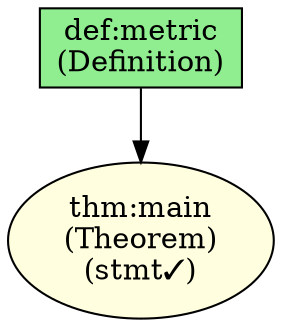

# TypeScript Graph Dependency Visualizer

This tool parses LaTeX files to extract mathematical dependencies (theorems, definitions, proofs) and creates both Graphviz DOT format and interactive web visualizations.

## Features

- **LaTeX Parsing**: Extracts `\begin{X}...\end{X}` blocks from `.tex` files
- **Command Extraction**: Finds `\command{text}` patterns (skips math mode `$ $`)
- **Dependency Tracking**: Uses `\uses{id}` to build dependency graphs
- **Lean Status**: Tracks `\leanok` completion status for theorems and proofs
- **Multiple Outputs**: 
  - Graphviz DOT format for static images
  - JSON data for web visualization
  - Interactive D3.js web interface

## Installation

```bash
npm install
npm run build
```

## Usage

### 1. Generate Dependency Graph

```bash
# Process current directory
node index.js

# Process specific directory
node index.js /path/to/tex/files
```

This creates output files in a `build/` directory in your current working directory:
- `build/dependency_graph.dot` - Graphviz format
- `build/dependency_graph.json` - JSON data for web visualization
- `build/dependency_graph.html` - Self-contained interactive visualization

### 2. Generate Static Images (requires Graphviz)

```bash
# Install graphviz first (macOS)
brew install graphviz

```bash
# Generate PNG
dot -Tpng build/dependency_graph.dot -o build/dependency_graph.png

# Generate SVG
dot -Tsvg build/dependency_graph.dot -o build/dependency_graph.svg
```
```

### 3. Web Visualization

The script automatically generates a self-contained HTML file with embedded data:

```bash
# Open the generated HTML file directly
open build/dependency_graph.html
```

Alternatively, for development or to use the standalone components:

```bash
# Start local server
npm run serve

# Open browser to http://localhost:8000
open http://localhost:8000
```

## LaTeX Format Requirements

### Block Structure
```latex
\begin{definition}\label{def:metric}
\leanok
A metric space is...
\uses{def:topology}
\end{definition}

\begin{theorem}\label{thm:main}
\leanok
Main result...
\uses{def:metric}
\end{theorem}

\begin{proof}
\leanok
Proof of main result...
\end{proof}
```

### Required Commands
- `\label{id}` - Unique identifier for the block
- `\uses{dependency_id}` - References to dependencies
- `\leanok` - Marks Lean formalization completion

### Supported Block Types
- `\begin{definition}` - Mathematical definitions
- `\begin{theorem}` - Theorem statements
- `\begin{lemma}` - Lemma statements (treated as theorems)
- `\begin{proof}` - Proof blocks (auto-linked to preceding theorem/lemma)

## Web Interface Features

### Interactive Visualization
- **Drag & Drop**: Move nodes to reorganize layout
- **Zoom & Pan**: Mouse wheel to zoom, drag background to pan
- **Tooltips**: Hover for detailed information
- **File Upload**: Load different JSON files

### Visual Coding
- **Shapes**: 
  - Rectangles = Definitions
  - Circles = Theorems/Lemmas
- **Colors**:
  - Green = Full Lean (statement + proof formalized)
  - Yellow = Partial Lean (statement only formalized)  
  - Red = No Lean formalization

### Controls
- **Reset Zoom**: Center and reset view
- **File Upload**: Load custom dependency graphs (optional)

## Output Examples

### DOT Format


### JSON Format
```json
[
  {
    "id": "def:metric",
    "type": "definition",
    "leanDone": true,
    "fileName": "./example.tex",
    "dependencies": []
  },
  {
    "id": "thm:main",
    "type": "theorem", 
    "statementLeanDone": true,
    "proofLeanDone": false,
    "fileName": "./example.tex",
    "dependencies": [{ "id": "def:metric", "type": "definition" }]
  }
]
```

## File Structure

```
├── index.ts          # Main CLI tool
├── web.ts            # D3.js visualization 
├── index.html        # Web interface template
├── package.json      # Dependencies & scripts
├── index.js          # Compiled CLI (generated)
├── web.js            # Compiled web code (generated)
└── build/            # Generated output files
    ├── dependency_graph.dot   # Generated DOT file
    ├── dependency_graph.json  # Generated JSON file
    └── dependency_graph.html  # Generated self-contained HTML
```

## Dependencies

- **TypeScript**: For type-safe development
- **D3.js**: For interactive web visualization
- **Node.js**: For file system operations
- **Graphviz**: (Optional) For static image generation

## Browser Support

Modern browsers with ES6+ support:
- Chrome 60+
- Firefox 55+
- Safari 12+
- Edge 79+
